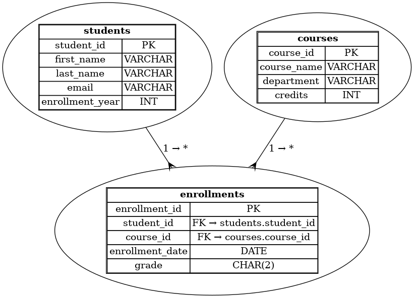

## 📊 Our University Schema (UML Diagram)



---

# 📦 Installing PostgreSQL on macOS and Windows

This guide will walk you through installing PostgreSQL locally on **macOS** and **Windows**, including tools like `psql` and `pgAdmin`.

---

## 🍏 macOS Installation (Using Homebrew)

### ✅ Step 1: Install Homebrew (if not already installed)

Open Terminal and run:
```bash
/bin/bash -c "$(curl -fsSL https://raw.githubusercontent.com/Homebrew/install/HEAD/install.sh)"
```

### ✅ Step 2: Install PostgreSQL
```bash
brew install postgresql
```

### ✅ Step 3: Start PostgreSQL Service
```bash
brew services start postgresql
```

### ✅ Step 4: Confirm Installation
```bash
psql --version
```

### ✅ Step 5: Create and Access a Database
```bash
createdb mydb
psql -l
```
-l will be used to verify that your db is created
---

## 🪟 Windows Installation (Using the Official Installer)

### ✅ Step 1: Download Installer
Go to [https://www.postgresql.org/download/windows/](https://www.postgresql.org/download/windows/) and download the installer.

### ✅ Step 2: Run the Installer

- Choose the version and installation directory.
- Set a password for the `postgres` superuser.

### ✅ Step 3: Launch SQL Shell or pgAdmin

- Open **SQL Shell (psql)** to use the command line.

### ✅ Step 4: Verify Installation
Run in the SQL Shell:
```bash
psql -l
```
Enter the password you set during installation.

---


